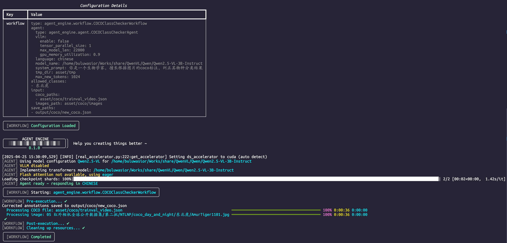

```
╭──────  AGENT ENGINE  ──────╮╮
│  ░▒▓░▒▓░▒▓░▒▓░▒▓░▒▓░▒▓░▒   ││  Help you creating things better ~
╰────────────────────────────╯╯
```
<p align="center">
A powerful and flexible framework designed to build, manage, and deploy intelligent agents for various applications.
</p>
<p align="center">
  <a href="#features">Features</a> •
  <a href="#installation">Installation</a> •
  <strong><a href="#demo">Usage</a></strong> •
  <a href="#contributing">Contributing</a> •
  <a href="#license">License</a>
</p>
<p align="center">
  
  
  
</p>

## 🌟 Todo
- **Computer Vision**
    - [x] COCO class checker
    - [ ] Classify, Detect, Segment
    - [ ] Label checker

- **Database**
    - [x] SQL queries, report and visualize

- **Search Online**
    - [x] Species meta searcher


## Features
- **Modular Architecture**: Easily customize and extend the framework to suit your needs.
- **Scalable Performance**: Handle tasks efficiently, from small-scale experiments to large-scale deployments.
- **Comprehensive API**: Seamlessly integrate with existing systems and workflows.


## Installation
To get started with AgentEngine, follow these simple steps:

```bash
git clone https://github.com/your-repo/agent-engine.git
cd agent_engine

# Install dependencies
pip install -r requirements.txt

# Install the package in editable mode
pip install -e .
```

## Demo
### Running a Workflow
> example in [run.py](run.py) for COCO class checker
- Create a new Python script.
- Import `create_workflow` function from `agent_engine.utils`
```python
from agent_engine.utils import create_workflow
```
- Initialize and execute the workflow using a configuration file (example config in [configs/for_computer_vision/coco_cls_checker.yaml](configs/for_computer_vision/coco_cls_checker.yaml))
```python
workflow = create_workflow(config="configs/for_computer_vision/coco_cls_checker.yaml")
workflow.execute()
```
### Config Customization
- `model_name: Qwen/Qwen2.5-VL-3B-Instruct`: you can change to your loacal model path, or you can use online api with `model_name` format in `api_url@api_key@model_name` (there are three parts seperated by `@`. for  example `https://openrouter.ai/api/v1/chat/completions@sk-or-v1-your-key@qwen/qwen2.5-vl-72b-instruct:free`)
- Every workflow has different config parameters, you can check the instruction in every config's directary
- Check the output in your terminal:

- Okey well ~ let's deep more into the `agent-engine` !!!

## Contributing

Contributions are welcome! Please submit your contribution in three steps:
1. Please fork the repository
2. Do your coding and submit a pull request
3. Describe what your codes improve
4. If you don't want to coding, you can submit issues as well. We keep opening to all users and contributors.

## License

This project is licensed under the Apache-2.0 License. See the [LICENSE](LICENSE) file for details.